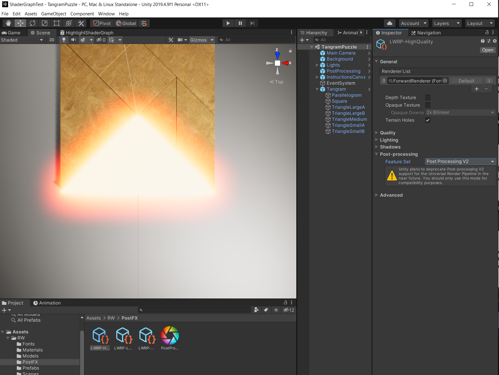
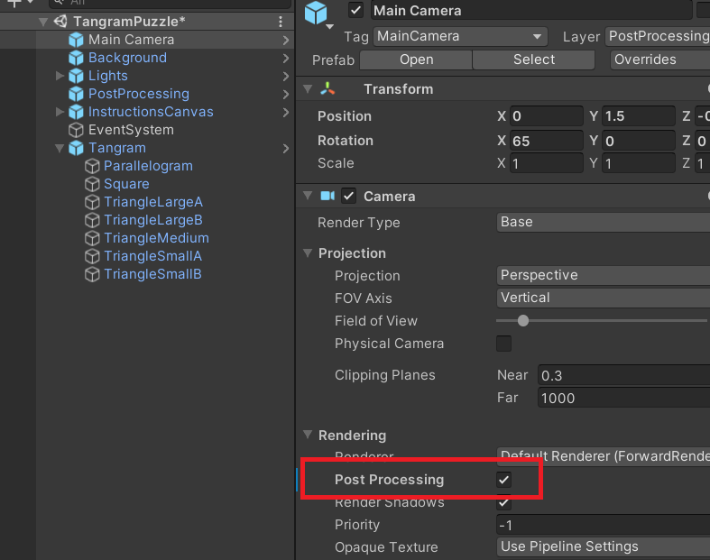

# Lab 10. 

**Zadanie 1** - wstęp do ShaderGraph

> Poniższy tutorial został przygotowany dla wersji 2019.2. W wersji 2019.3 LWRP zostało zastąpione poprzez URP, ale można dokonać konwersji w razie potrzeby: https://docs.unity3d.com/Packages/com.unity.render-pipelines.universal@10.2/manual/upgrade-lwrp-to-urp.html

> Niektóre efekty nie działają z automatu bez zmiany parametrów przy korzystaniu z materiałów projektu w Unity 2019.4. Między innymi należy zmienić ustawienia post-processing dla wybranych ustawień jakości LWRP. Widok na poniższym zrzucie ekranu.

Następnie należy również zmienić ustawienia dla głównej kamery:

Wykonaj tutorial spod adresu https://www.raywenderlich.com/3744978-shader-graph-in-unity-for-beginners i przedstaw swój rezultat w postaci krótkiego filmu lub kilku zrzutów ekranu przed końcem zajęć. Zmień kolory wykorzystywane w tutorialu dla podświetlenia "klocków".

**Zadanie 2** - elementy gry 2D.

Wykonaj tutorial spod adresu https://www.raywenderlich.com/8094424-unity-2d-techniques-build-a-2d-pinball-game. 